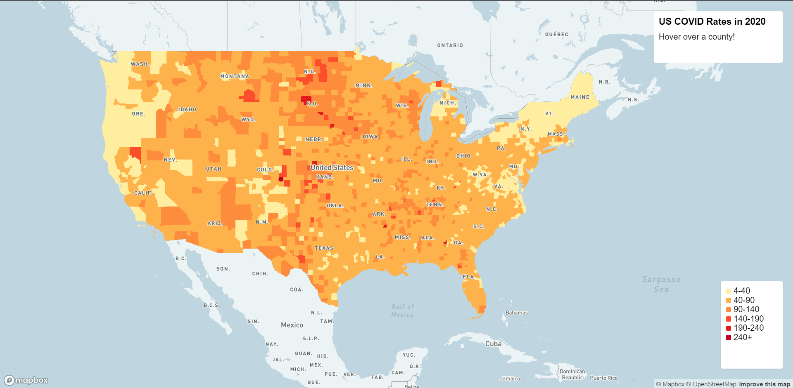
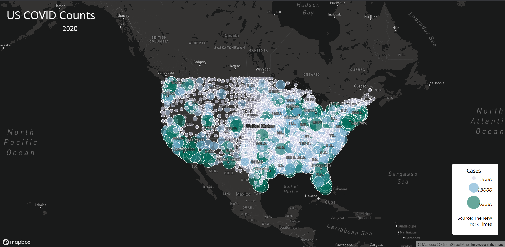

# 2020 US COVID Rate & Counts Maps

In this project, we use a proportional map to showcase 2020 COVID Counts
in the US. We also use a choropleth map to showcase 2020 COVID rates. Both
are at the county level.

[Map 1](https://diaza6.github.io/2020-covid-maps/map1.html)

[Map 2](https://diaza6.github.io/2020-covid-maps/map2.html)

The maps use the Mapbox API, The COVID-19 case/death data is originally from The
New York Times. The data includes all the cases in 2020. The population data used
for calculating the case rates are from the 2018 ACS 5 year estimates. Both data
are at the county level. The U.S. county boundary shapefile was downloaded from
the U.S. Census Bureau.
